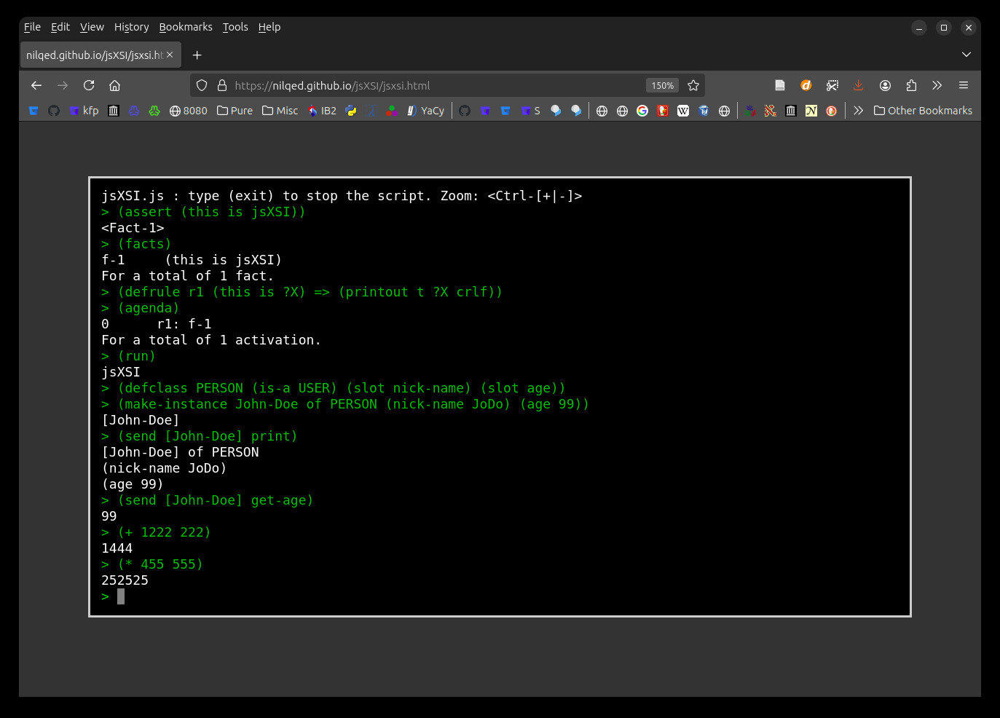

# jsXSI
Javascript Expert System Interface (includes CLIPS/COOL[^1])

Standalone html file ``jsxsi.html`` (~10MB):  [Test it.](http://nilqed.github.io/jsXSI/jsxsi.html)

[^1]: [clips-rules](https://www.clipsrules.net/)
